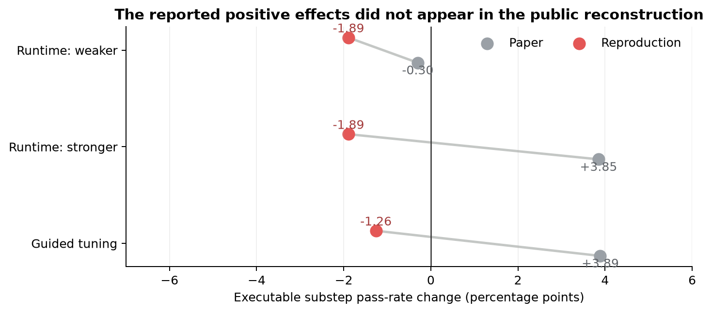
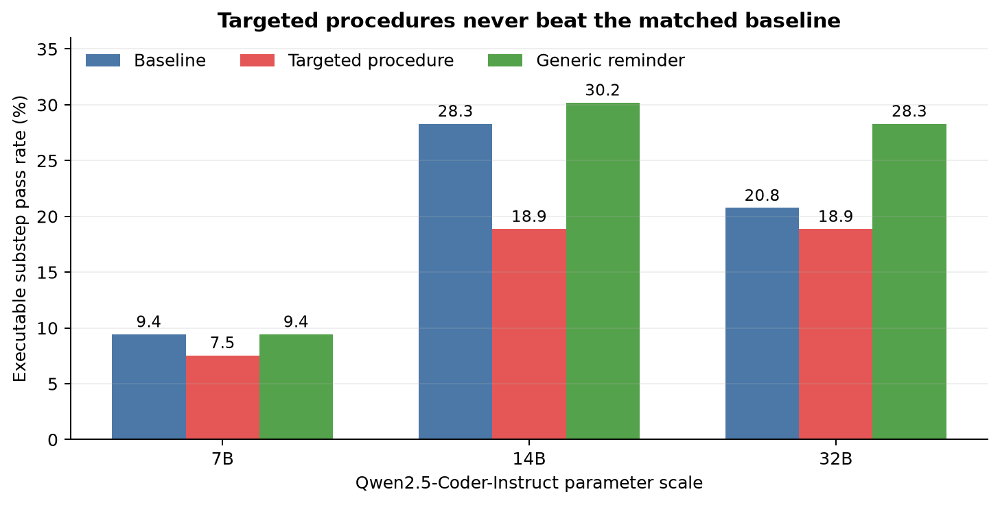
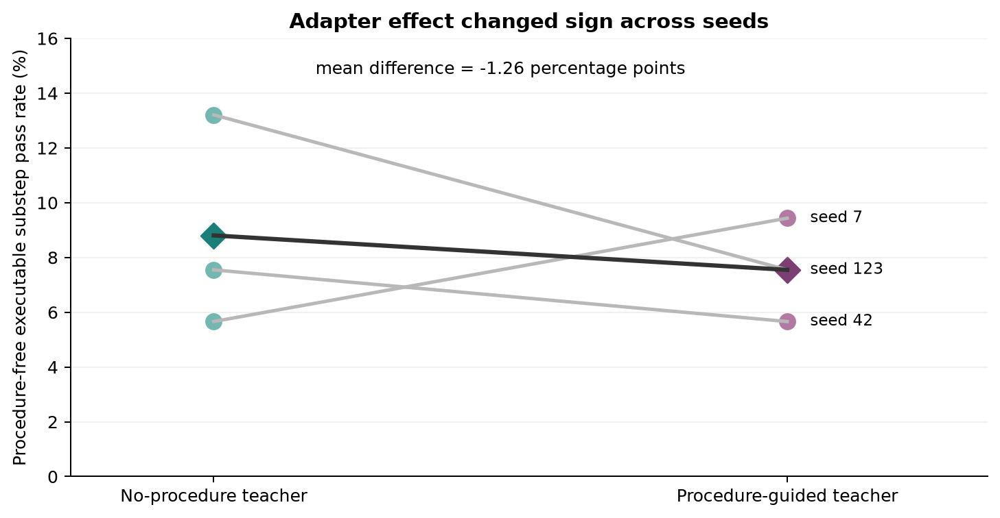
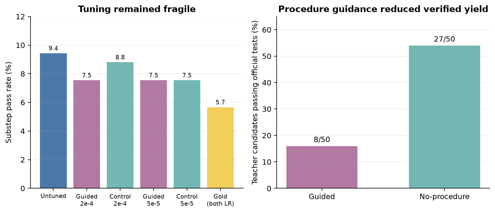

# Reproducing procedural knowledge consolidation on SciCode

Scientific coding models can sometimes solve a problem after being shown a useful working procedure, but that does not mean they can reliably execute or retain the procedure. The paper *From Execution to Capability* argues that verified experience can be distilled into reusable guidance and then taught to a weaker model, and this reproduction tested both the immediate prompting effect and the later procedure-free capability gain.

**Verdict: not reproduced under this bounded public reconstruction.** The reconstructed scientific procedures did not improve runtime executable accuracy for the stronger substitute, and three matched adapter seeds slightly favored supervision produced without procedures.

**Scope.** Public SciCode problems and official executable tests; Qwen2.5-Coder-Instruct 7B, 14B, and 32B substitutes; a primary 12-problem/53-substep slice; three exact eight-example adapter pairs. Runs used Kubernetes on NVIDIA RTX PRO 6000 Blackwell GPUs, with 16 GPUs allocated concurrently at peak and 3.01 hours elapsed from first submit to the last result.

Positive values mean the procedure condition passed more executable substeps than its matched control. The paper reported a positive runtime effect for its stronger model and a positive guided-tuning effect; both reproduction estimates were negative. These observations apply to the public substitutions below, not to the unreleased original implementation.

## What was reconstructed

The author-linked implementation, exact procedures, trajectories, and checkpoints were unavailable. We therefore built a transparent minimum reproduction:

1. Select SciCode test problems by public benchmark-position quartile and chain length; the public JSON omits the paper's private domain labels.
2. Run generated functions against SciCode's official HDF5 tests. The primary metric is substep pass rate; a main problem passes only when every evaluated substep passes.
3. Prompt models with either no addition, a cross-task procedure covering interface, array, numerical, and dependency-flow audits, or a length-matched generic code-quality reminder.
4. For consolidation, let the 32B teacher generate 50 public development-step candidates, retain verifier-passing code, cap both conditions at exactly eight examples, train separate rank-16 one-epoch LoRA adapters on the 7B model, then deploy without procedures on the fixed test slice.

Decoding was deterministic with a 1,024-token cap. Every reported number came from a successful Kubernetes run with a nonempty terminal log and `FINAL_METRICS_JSON`.

## Runtime procedures did not show the reported scaling pattern

On the same 53 substeps, targeted procedures changed the 7B, 14B, and 32B pass rates by −1.89, −9.43, and −1.89 percentage points. The 14B model was strongest before prompting, so raw benchmark accuracy was itself non-monotonic in parameter count. Generic reminders were neutral or helpful: 0.00, +1.89, and +7.55 points. Thus the targeted loss was not merely the cost of a longer prompt.

The paper's all-problem runtime table reported −0.30 points for its weaker model and +3.85 for its stronger model, with a +6.26-point stronger-model main-problem gain. Here the 7B and 32B targeted deltas were both −1.89 substep points and 0 main points. On a second slice, the 14B targeted condition again fell from 21/71 to 15/71 while the generic reminder rose to 23/71.

## Guided tuning was seed-sensitive and negative on average

Exact eight-example pairs changed sign: guided-minus-control was −1/53, +2/53, and −3/53 passes for seeds 42, 7, and 123. Averaged across seeds, guided adapters scored 4.00/53 (7.55%) and controls 4.67/53 (8.81%), a −1.26-point difference. Full-problem means were 2.78% versus 5.56%, a −2.78-point difference.

The paper reported +3.89 substep and +6.25 main-problem points for guided versus no-procedure tuning over all problems. This reproduction did not show those gains. It also used LoRA rather than the paper's full supervised tuning and only eight examples per condition, so the assessment is **inconclusive about the original scale but not aligned under the tested setup**.

## Diagnostics point to tuning fragility

Lowering the learning rate from 2×10⁻⁴ to 5×10⁻⁵ made the guided and control adapters tie at 4/53. Two gold-code diagnostics each scored 3/53, below the untuned 5/53 baseline, showing that this tiny one-epoch LoRA regime could erase capability even with verified targets. Procedure-guided teacher generation also yielded only 8/50 executable examples versus 27/50 without procedures.

## Assessment and limitations

| Claim | Paper result | Observed result | Assessment |
|---|---:|---:|---|
| Stronger model benefits more from runtime procedures | Strong: +3.85 substep, +6.26 main points | 32B: −1.89, 0; 14B: −9.43, −8.33 | Not aligned |
| Guided supervision improves procedure-free weak model | +3.89 substep, +6.25 main points | Three-seed mean: −1.26, −2.78 | Not aligned |

The main limitations are the unavailable original artifacts, smaller substitute models, a small fixed SciCode slice, reconstructed rather than learned procedures, and LoRA rather than full-model tuning. Kubernetes jobs allocated four GPUs each to keep the 16-GPU cluster full, but after tensor-parallel and distributed shared-memory failures the stable implementation used one active GPU per job; peak concurrent allocation was still 16 NVIDIA RTX PRO 6000 Blackwell GPUs. A faithful full-scale reproduction still needs the authors' procedures, split metadata, concretized supervision, checkpoints, and training recipe.

Code and provenance are on the public branches for the [runtime 7B baseline](https://github.com/alphaXiv/from-execution-to-capability-scientific-experien/tree/orx/k8s-shell-fixed-weaker-baseline), [runtime 32B procedures](https://github.com/alphaXiv/from-execution-to-capability-scientific-experien/tree/orx/runtime-round-stronger-plus-procedures), [three-seed guided adapters](https://github.com/alphaXiv/from-execution-to-capability-scientific-experien/tree/orx/procedure-guided-lora-consolidation), and [matched controls](https://github.com/alphaXiv/from-execution-to-capability-scientific-experien/tree/orx/eight-example-no-procedure-lora-control).

